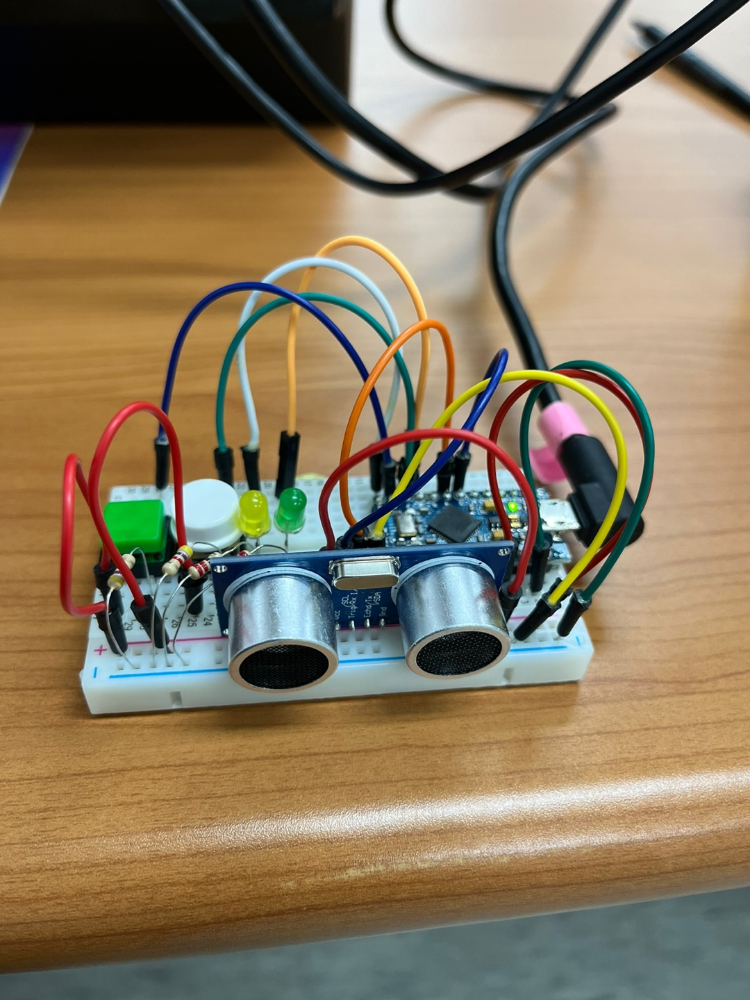
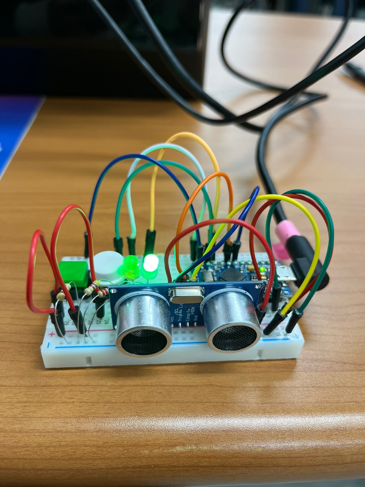
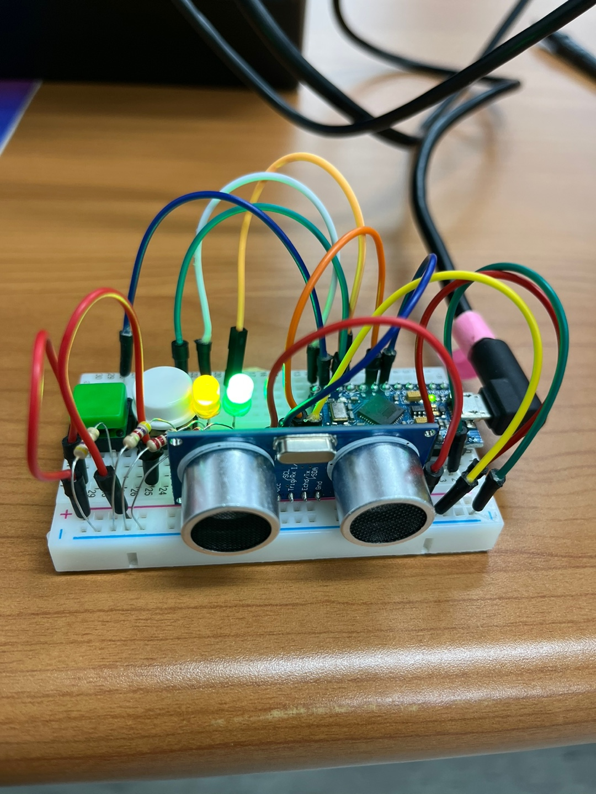

# 초음파센서와 객체인식을 통한 몰컴 프로젝트

    
    
    

# 개발기간
2023.04.24 ~ 2023.04.28

# 참여인원
1명

# 개발환경
Arduino IDE 2.1 라이브러리 버전
VScode Python

# 주요기능
+ 컴퓨터 모니터를 제어하는 3가지 모드가 있고 버튼을 눌러서 모드를 변경할 수 있다.
  + 초기상태 : 모니터 화면이 바탕화면을 보이게 하는 기능을 한다.
  + 버튼을 한 번 눌렀을 시 : ALT+TAP 기능을 한다.
  + 버튼을 두 번 눌렀을 시 : 컴퓨터를 종료 시키는 기능을 한다.

# 작업시간
약 30시간

# 데모
https://user-images.githubusercontent.com/129160008/235036656-0ab524e7-230e-4101-aa29-8532c26580d8.mp4

# 알려진 이슈
https://user-images.githubusercontent.com/129160008/235045723-aee8d609-1c09-4a5d-b065-e160a56d4ba4.mp4
+ 카메라를 이용한 시리얼 통신에 딜레이가 생겨서 반응이 느리다.
+ 카메라에 얼굴이 인식되고 센서에도 인식이 되면 카메라에 얼굴이 인식되는 동안 같은 행동을 반복한다
    + 따라서 두가지 모드 보다 컴퓨터가 꺼지는 모드를 사용하는 것이 가장 유용하다고 판단된다.
